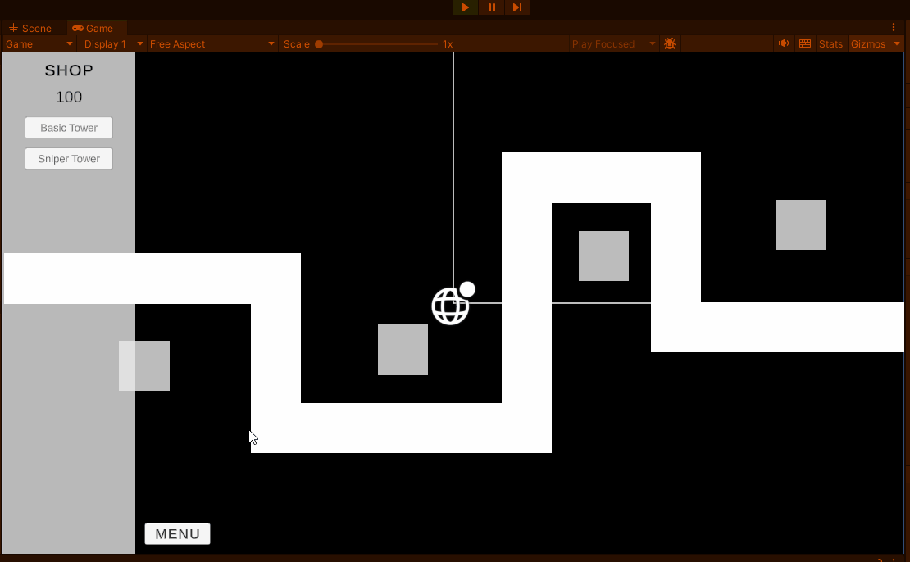
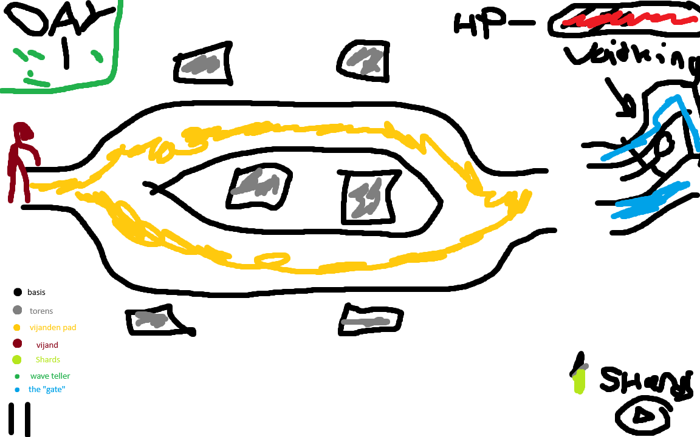

# GAMEPLAY

# Sprint 0 - Game Design Document : Tower Defense
Naam: Thomas Born

Klas: SD2B

Datum: 08/09/2025

# 1. Titel en elevator pitch
Titel: Void kingdom 

Elevator pitch, maximaal twee zinnen: Beschrijf kort wat jouw game is en waarom het leuk is om te spelen.

Mijn game is een standaard towerdefense waarbij de voidking beschermt met de void torens. mijn game is leuk om te spelen want het heeft goeie replayablity.

# 2. Wat maakt jouw tower defense uniek
Beschrijf in één of twee zinnen wat jouw game onderscheidt van een standaard tower defense. Denk aan iets dat de speler op een nieuwe manier laat nadenken of spelen.

bij mijn game is er void damage hoe meer void damage je doet hoe meer currency je krijgt waarbij die voor upgrades kan gebruiken

# 3. Schets van je level en UI
Maak een schets op papier of digitaal en voeg deze afbeelding toe aan je repository. Voeg in deze sectie de afbeelding in.

Je schets bevat minimaal:

Het pad waar de vijanden over lopen met beginpunt en eindpunt.
De plaatsen waar torens gebouwd kunnen worden.
De locatie van de basis of goal die verdedigd moet worden.
De UI onderdelen geld, wave teller, levens, startknop en pauzeknop.
Een legenda met symbolen of kleuren voor torens, vijanden, pad, basis en UI.
# 4. Torens
Toren 1 naam, bereik, schade, unieke eigenschap.

void controller, groot, 6 damage per hit of 9 void damage(10% kans), het doet damage per tik in bursts zo een keer is 30/35 damage. 
Toren 2 naam, bereik, schade, unieke eigenschap.

void spiker, klein/medium, 40/50 damage of 60 void damage(10% kans), als een enemy wordt gespiked dan wordt hij slomer voor 5 sec.
Eventuele extra torens:

# 5. Vijanden
Vijand 1 naam, snelheid, levens, speciale eigenschap.

horror of normality, slow/medium, 100hp, hij heeft geen speciale eigenschappen maar wanneer hij 10 hp is wordt hij sneller met 50%

Vijand 2 naam, snelheid, levens, speciale eigenschap.

horror of speed, snel, 40/50 hp, it's very fast 

Eventuele extra vijanden:

# 6. Gameplay loop
Beschrijf in drie tot vijf stappen wat de speler steeds doet. 

1. towers plaatsen
2. start wave
3. towers kill enemy's
4. get currency
5. buy/upgrade towers
6. repeat

# 7. Progressie
Leg uit hoe het spel moeilijker wordt naarmate de waves doorgaan. Denk aan sterkere vijanden, kortere tussenpozen, hogere kosten of lagere beloningen.

hoelanger het spel door gaat worden de enemys sterker sneller , enemy's krijgen speciale ablity. 
# 8. Risico’s en oplossingen volgens PIO
Probleem 1: void damage doet alleen damage 

Impact: te makkelijk

Oplossing: proberen om kans code te doen

Probleem 2: normality enemy blijft in hyper mode

Impact: enemy is veel te sterk

Oplossing: docenten vragen of op internet opzoeken

Probleem 3: tower wilt geen damage doen

Impact: jij gaat alleen maar dood

Oplossing: vind het probleen in code niet werkt vraag docent

# 9. Planning per sprint en mechanics
Schrijf per sprint welke mechanics jij oplevert in de build. Denk aan voorbeelden zoals vijandbeweging over een pad, torens plaatsen, doel kiezen en schieten, waves starten, UI voor geld en levens, upgrades, jouw unieke feature.

Sprint 1 mechanics: enemy's + enemy path, tower placing

Sprint 2 mechanics: tower damage enemys, money 

Sprint 3 mechanics: start wave , pause, UI deel 1

Sprint 4 mechanics: UI deel 2, upgrades, health + damage getting

Sprint 5 mechanics:alles fixen dat niet werkt

# 10. Inspiratie
Noem een bestaande tower defense game die jou inspireert en wat je daarvan meeneemt of juist vermijdt.

kingdom rush player ablities te complex 
# 11. Technisch ontwerp mini
Lees dit korte voorbeeld en vul daarna jouw eigen keuzes in.

Voorbeeld ingevuld bij 11.1 Vijandbeweging over het pad

Keuze: Vijanden volgen punten A, B, C en daarna de goal.
Risico: Een vijand loopt een punt voorbij of blijft hangen.
Oplossing: Als de vijand dichtbij genoeg is kiest hij het volgende punt. Bij de goal gaat één leven omlaag en verdwijnt de vijand.
Acceptatie: Tien vijanden lopen van start naar de goal zonder vastlopers en verbruiken elk één leven. Alle tien vijanden bereiken achtereenvolgens elk waypoint binnen één seconde na elkaar.

### 11.1 Vijandbeweging over het pad
Keuze: vijand kiezen 2 paden

Risico: ze kiezen maar 1 pad

Oplossing: bij de intersectie kiezen ze een pad, ze doen damage tegen de king

Acceptatie:bij 10 vijanden is het verspried met 5 enemys die 1 pad op gaan en de andere 5 op het andere pad gaan lopen

### 11.2 Doel kiezen en schieten
Keuze: towers schieten naar enemy's

Risico: ze schieten buiten hun range

Oplossing: ik maak een max range functie zo dat dat niet gebeurt, towers doen damage aan enemy's

Acceptatie: ze schieten naar enemy's in hun range

### 11.3 Waves en spawnen
Keuze: waves met button spawnen

Risico: wave start 

Oplossing: wave begginnen met timer, enemy's spawnen heeft detectie voor wave start

Acceptatie: enemys spawnen met 10, een wave start goed

### 11.4 Economie en levens
Keuze: currency voor de torens te kopen

Risico: currency werkt niet 

Oplossing: maak een button die currency goed detecteert, levens erbij kopen

Acceptatie:levens kunnen erbij komen en currency wordt goed gegeven na wave clear

### 11.5 UI basis
Keuze: wave teller boven kant van scherm

Risico: ze updaten niet

Oplossing: maak een script die checkt of wave teller is geupdated, pauze pauzeert de game

Acceptatie: wave teller update met goeien nummer, pauze heeft goeie ui